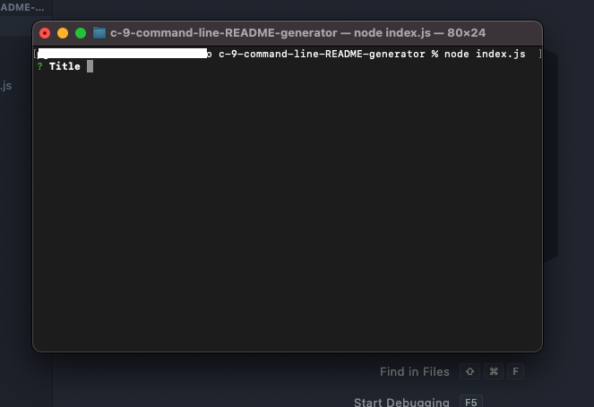
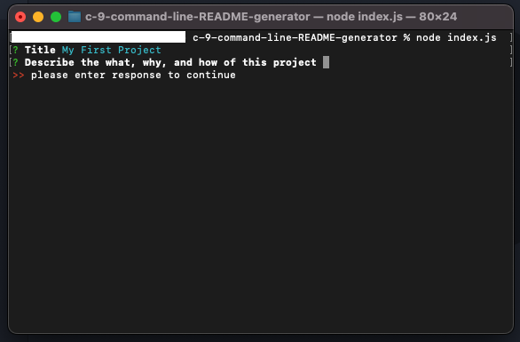
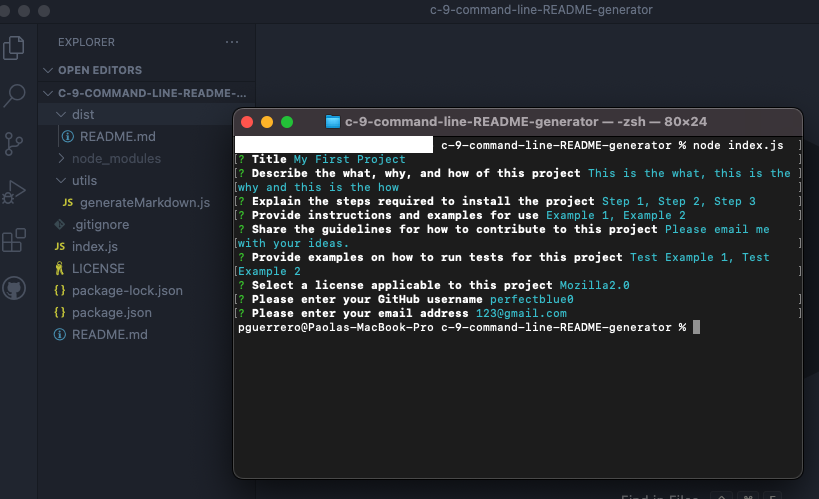
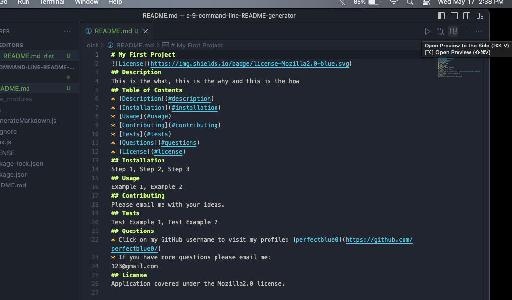
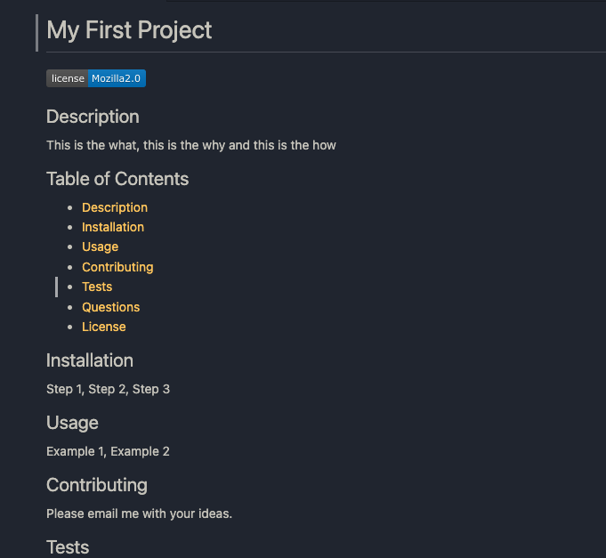

# c-9-command-line-README-generator

## Description
I created this project to practice using the command-line, node.js, and the Inquirer package. This application saves any developer’s time by removing the styling steps when creating a README.md. In addition, this application also generates a fancy blue button with the name of the license that the user chooses. During the making of this project I learned how to install a node package and fortified my knowledge of working with Git.

## Table of Contents
- [Installation](#installation)
- [Usage](#usage)
- [Credits](#credits)
- [License](#license)

## Installation
To use the application clone the repo to a folder or save it to your desktop. Use the command line to travel to the project. Open the project on Visual Studio Code by entering “code .” You will then see the folders and files of the project.

## Usage
For a preview of the basic functionality of this application, visit this link.
https://drive.google.com/file/d/1TeB8wxbDObrj7rTuuJVydEvfA126bHwe/view  
### My Repo
https://github.com/perfectblue0/c-9-command-line-README-generator  

This application is intended to be used to generate README.md files without having to style them with markdown language. Once you have followed the Installation instructions, in the command-line, type “node index.js” and then press “enter” on your keyboard. Users will then see a question to which they should type a response and press “enter” on their keyboard. 
  

Users must answer all questions otherwise they will get a message requesting they type in an answer.
  

To answer the question about which license the user wants, use the up and down arrows to highlight the license, and press enter to select the license. Once they have shared the email and pressed “enter” they will then be able to go back to Visual Studio Code, click on the folder “dist”, and below they will see their newly generated README.md.
  
Click on the folder "dist" then on the newly generated "README.md" to view the new file.
  
To see a preview of the new file click on the "Open Preview to the Side" button, as highlighted in the above picture (it's on the right side and looks like an open book with a magnifying glass).

## Credits
To make this application I used starter code provided by UC Berkeley Full-Stack Coding Bootcamp. I made my project with help from the Zoom recording where Samantha Randolph, my professor, showed the class how to get started and a YouTube tutorial by DopeDev called “How to create a README Generator (TUTORIAL)” which can be found here https://www.youtube.com/watch?v=9YivEQFpmHQ  

## License
Please refer to the repo.

